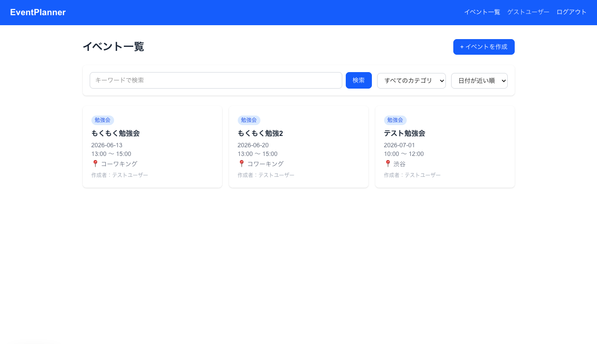
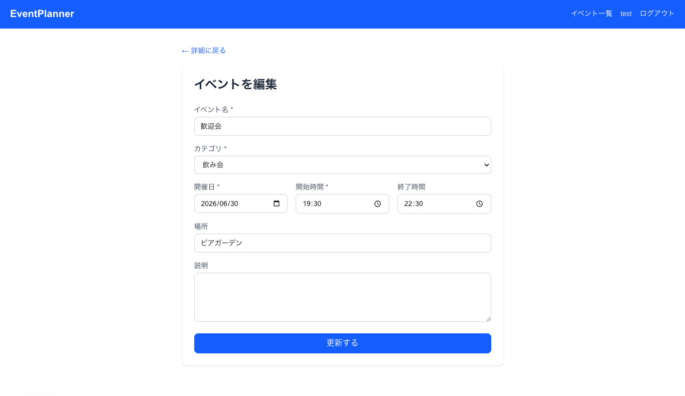
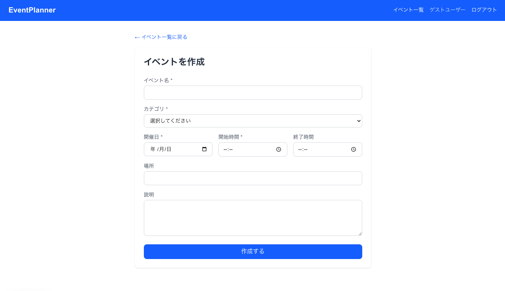
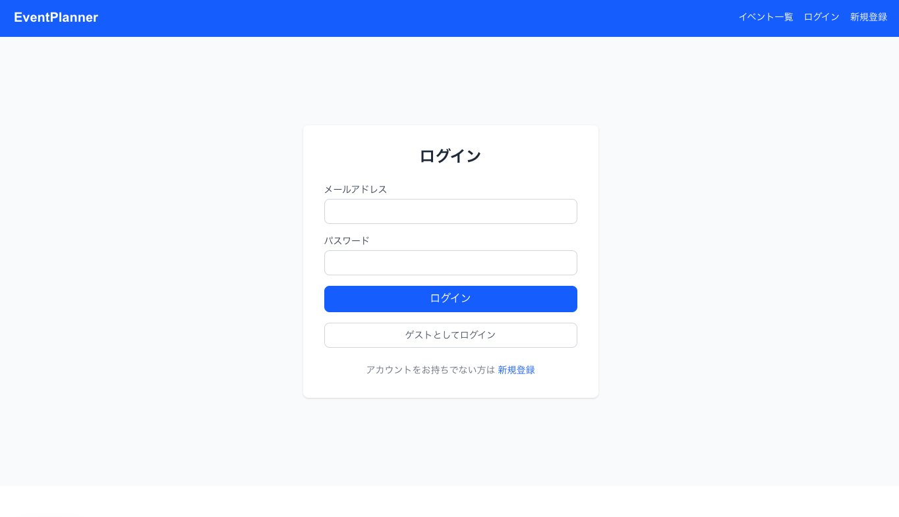
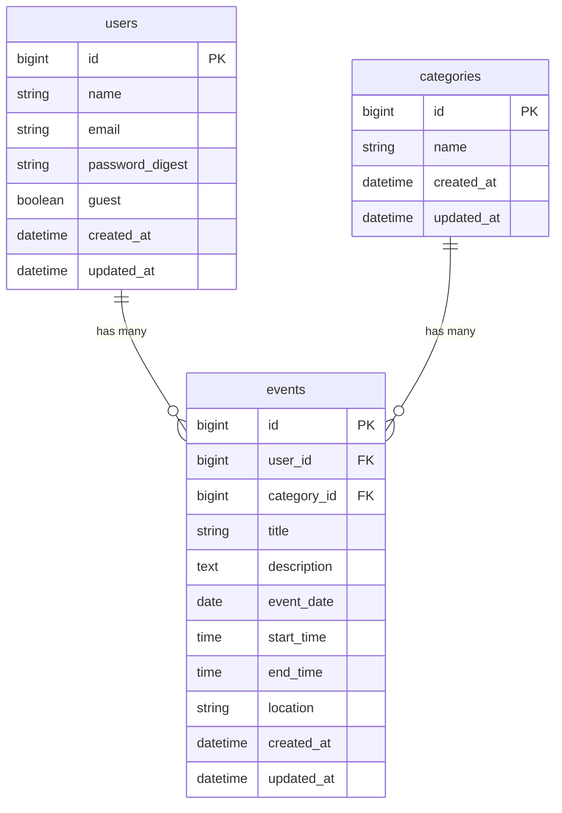

# EventPlanner

イベント予定を登録・管理できるWebアプリです。Ruby on Rails（API）+ Next.js で構築したフルスタックWebアプリケーションです。

---

## アプリ概要

勉強会・飲み会・旅行など、日常的に発生するイベント予定を一元管理するWebアプリです。

### 開発背景

複数の予定をLINEのメモやスプレッドシートに記録していると、「あの勉強会はいつだったか」「どこで開催されるか」を後から探すのに時間がかかるという課題がありました。また、参加するイベントが増えるほど情報が散在し、見落としが発生しやすくなります。

この課題を解決するために、イベント情報を登録・検索・管理できるWebアプリを開発しました。

### 解決できること

- **情報の一元管理**：イベント名・日時・場所・説明をひとつの画面で登録・確認できる
- **素早い検索**：キーワード検索やカテゴリ絞り込みで目的のイベントをすぐに見つけられる
- **安心して試せる**：ゲストログイン機能により、アカウント登録なしでもすぐに全機能を体験できる

---

## アプリURL

http://13.239.247.218

### テストアカウント

| アカウント | メールアドレス | パスワード |
|-----------|-------------|---------|
| テストユーザー | test@example.com | password123 |
| ゲストログイン | ワンクリックでログイン可能 | 不要 |

---

## 画面構成

### ① トップ画面


アプリの説明とイベント一覧・新規登録へのリンクを表示。未ログイン状態でもアクセス可能。

---

### ② イベント一覧画面



登録済みイベントをカード形式で一覧表示。キーワード検索・カテゴリ絞り込み・日付順ソートが可能。ログイン中は「イベントを作成」ボタンを表示。

---

### ③ イベント詳細画面



1件のイベント情報（タイトル・開催日・時間・場所・説明）を表示。作成者本人のみ編集・削除ボタンが表示される。

---

### ④ イベント作成・編集画面



イベント名・カテゴリ・開催日・開始時間・終了時間・場所・説明を入力して登録。バリデーションエラーは日本語でフォーム上部に表示される。

---

### ⑤ ログイン・新規登録画面



メールアドレスとパスワードでログイン。「ゲストとしてログイン」ボタンでアカウント登録なしにすぐ操作できる。

---

## 実装済み機能

| 機能 | 説明 |
|------|------|
| ユーザー登録 | 名前・メールアドレス・パスワードで新規アカウント作成 |
| ログイン / ログアウト | JWT認証によるログイン・ログアウト |
| ゲストログイン | アカウント登録不要でワンクリックでお試し操作が可能 |
| イベント作成 | タイトル・カテゴリ・日時・場所・説明を入力して登録 |
| イベント一覧表示 | 登録済みイベントをカード形式で一覧表示 |
| イベント詳細表示 | 1件のイベント情報を全て確認 |
| イベント編集 | 作成者本人のみ内容を変更できる |
| イベント削除 | 作成者本人のみ確認ダイアログを経て削除できる |
| キーワード検索 | イベント名・説明文でリアルタイム検索 |
| カテゴリ絞り込み | カテゴリ選択でフィルタリング |
| 日付順ソート | 開催日の昇順・降順で並び替え |
| フラッシュメッセージ | 作成・更新・削除後に操作結果を通知 |
| バリデーション | フロントエンド・バックエンド両方で入力チェック |
| 権限制御 | 自分が作成したイベントのみ編集・削除できる |

## 今後実装予定の機能

| 機能 |
|------|
| マイページ（自分が作成したイベント一覧） |
| イベントの公開・非公開設定 |
| 参加予定フラグ |
| 期限が近いイベントの強調表示 |
| カレンダー表示 |

---

## 技術スタック

### バックエンド

| 役割 | 技術 | バージョン | 選定理由 |
|------|------|----------|---------|
| 言語 | Ruby | 3.3.2 | 記述量が少なく可読性が高い・Railsとの親和性 |
| フレームワーク | Ruby on Rails | 8.1.3 | APIモードで軽量に使用可能・設定より規約で素早く開発できる |
| 認証 | JWT（jwt gem） | 3.2.0 | ステートレスな認証・フロントとの分離に適している |
| パスワード暗号化 | bcrypt | 3.1.x | Railsの `has_secure_password` と組み合わせて安全に暗号化 |
| ORM | Active Record | Rails同梱 | SQLを意識せずモデルでDB操作が可能 |

### フロントエンド

| 役割 | 技術 | バージョン | 選定理由 |
|------|------|----------|---------|
| フレームワーク | Next.js | 16.x | App Router・SSR対応・ファイルベースルーティング |
| 言語 | TypeScript | 5.x | 型安全・補完が効くことでバグを事前に防げる |
| スタイリング | Tailwind CSS | 4.x | クラス名でUIを組め・デザインの一貫性を保ちやすい |
| 状態管理 | React Context API | React同梱 | 外部ライブラリなしでログイン状態をアプリ全体で共有 |

### インフラ

| 役割 | 技術 |
|------|------|
| データベース | MySQL 9.6 |
| Webサーバー | Puma（Rails同梱） |
| デプロイ | AWS EC2 / RDS（予定） |

---

## 品質管理への取り組み

### フロントエンド

- **TypeScript** による型定義でAPIレスポンスの型を明示し、実行前にバグを検出
- **React Context** によるログイン状態管理で、不要なprop drilling（バケツリレー）を排除
- フォームコンポーネントの共通化（`EventForm`）により、作成・編集で同一UIを再利用

### バックエンド

- **Active Record バリデーション**（`presence` / `uniqueness` / `length` / `format`）でデータの整合性を保証
- **`before_action`** による認証チェック・権限チェックの共通化
- **scope** を使ったクエリの整理（検索・絞り込み・ソートをモデルに集約）
- **`has_secure_password`** + **bcrypt** によるパスワードの安全な暗号化
- **i18n（日本語化）** によりバリデーションエラーを日本語で返却

---

## API一覧

### 認証

| メソッド | エンドポイント | 認証 | 説明 |
|---------|--------------|------|------|
| POST | `/api/v1/auth/signup` | 不要 | ユーザー登録 |
| POST | `/api/v1/auth/login` | 不要 | ログイン（JWTトークンを返す） |
| POST | `/api/v1/auth/guest_login` | 不要 | ゲストログイン |

### イベント

| メソッド | エンドポイント | 認証 | 説明 |
|---------|--------------|------|------|
| GET | `/api/v1/events` | 不要 | イベント一覧（検索・絞り込み・ソート対応） |
| GET | `/api/v1/events/:id` | 不要 | イベント詳細 |
| POST | `/api/v1/events` | 必要 | イベント作成 |
| PUT | `/api/v1/events/:id` | 必要（作成者のみ） | イベント更新 |
| DELETE | `/api/v1/events/:id` | 必要（作成者のみ） | イベント削除 |

### カテゴリ

| メソッド | エンドポイント | 認証 | 説明 |
|---------|--------------|------|------|
| GET | `/api/v1/categories` | 不要 | カテゴリ一覧 |

### クエリパラメータ（イベント一覧）

| パラメータ | 例 | 説明 |
|---------|---|------|
| `keyword` | `?keyword=勉強会` | タイトル・説明のキーワード検索 |
| `category_id` | `?category_id=1` | カテゴリで絞り込み |
| `sort` | `?sort=desc` | `asc`（昇順） / `desc`（降順） |

---

## ER図



---

## 工夫した点

- **ゲストログイン機能**：ポートフォリオを見た方がすぐに操作できるよう、アカウント登録なしでログインできる仕組みを実装した
- **フロント・バック両方のバリデーション**：フロントはHTMLのrequired属性、バックはRailsのバリデーションで二重チェックし、不正なデータの登録を防いだ
- **権限制御**：自分が作成したイベントのみ編集・削除できるよう、バックエンドでuser_idを照合する制御を実装した
- **フラッシュメッセージ**：Context APIを使ってアプリ全体でメッセージを管理し、操作後3秒で自動的に消える仕組みにした
- **i18n（日本語化）**：Railsのバリデーションエラーを日本語で返すよう設定し、ユーザーが理解しやすいエラー表示にした

---

## 苦労した点

- **JWTとフロントの連携**：ログイン後のトークンをlocalStorageで管理し、APIリクエストのAuthorizationヘッダーに付与する仕組みの実装に苦労した
- **apiFetchのヘッダー設計**：`Content-Type` と `Authorization` を両立するヘッダーの結合方法を正しく実装する必要があった
- **Next.jsのApp Router**：従来のPages Routerと異なる構造に慣れるまで時間がかかった

---

## 今後の改善点

- マイページの実装（自分が作成したイベントの管理）
- イベントの公開・非公開設定
- 参加予定フラグ（中間テーブルによる多対多リレーション）
- カレンダー表示
- テストコードの追加（RSpec / Jest）

---

## ローカル環境での起動方法

### 前提条件

- Ruby 3.3.2 以上
- Node.js 22 以上
- MySQL 9.x 以上（起動済みであること）

### 1. リポジトリをクローン

```bash
git clone https://github.com/KAT-brave/EventPlanner.git
cd EventPlanner
```

### 2. バックエンドを起動

```bash
cd backend
bundle install
rails db:create db:migrate db:seed
rails s -p 3001
# → http://localhost:3001 で起動
```

### 3. フロントエンドを起動

```bash
cd frontend
npm install
npm run dev
# → http://localhost:3000 で起動
```

### 4. ブラウザで確認

`http://localhost:3000` にアクセスし、「ゲストとしてログイン」でお試しいただけます。

---

## AWS構成

（デプロイ後に追加）
