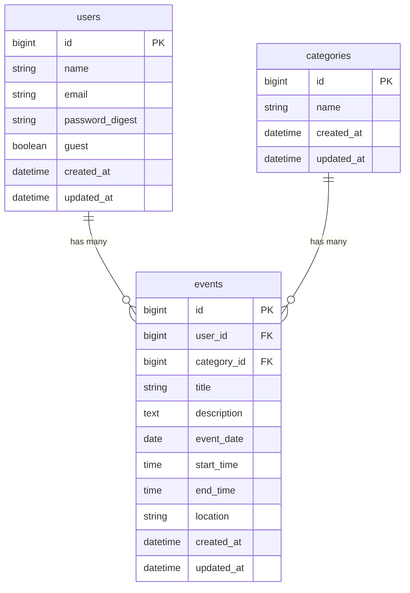

# ER図

```mermaid
erDiagram
    users {
        bigint id PK
        string name
        string email
        string password_digest
        boolean guest
        datetime created_at
        datetime updated_at
    }
    categories {
        bigint id PK
        string name
        datetime created_at
        datetime updated_at
    }
    events {
        bigint id PK
        bigint user_id FK
        bigint category_id FK
        string title
        text description
        date event_date
        time start_time
        time end_time
        string location
        datetime created_at
        datetime updated_at
    }
    users ||--o{ events : "has many"
    categories ||--o{ events : "has many"
```
